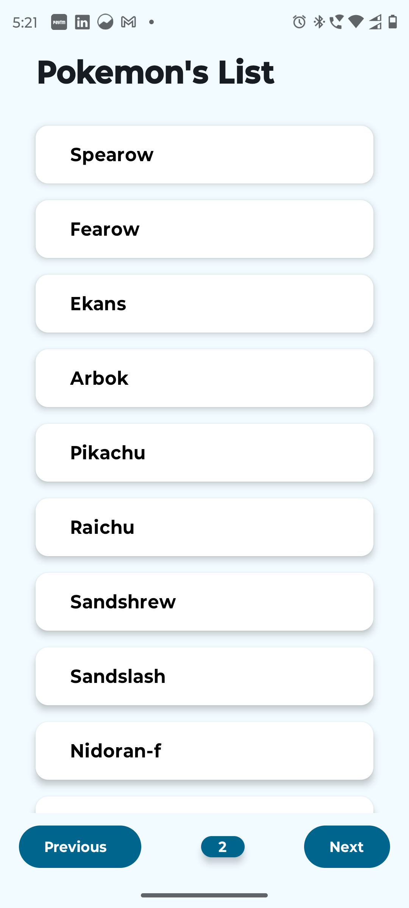
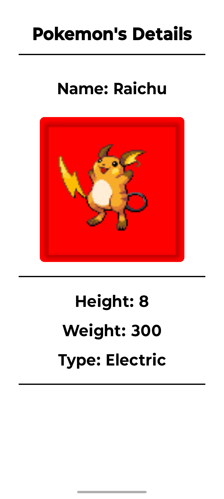
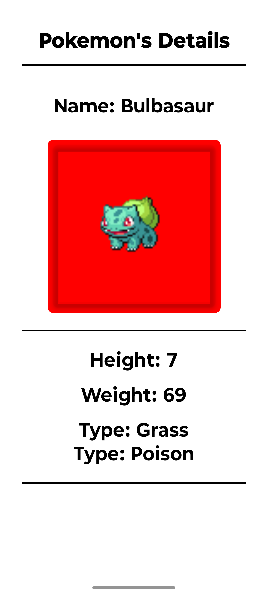
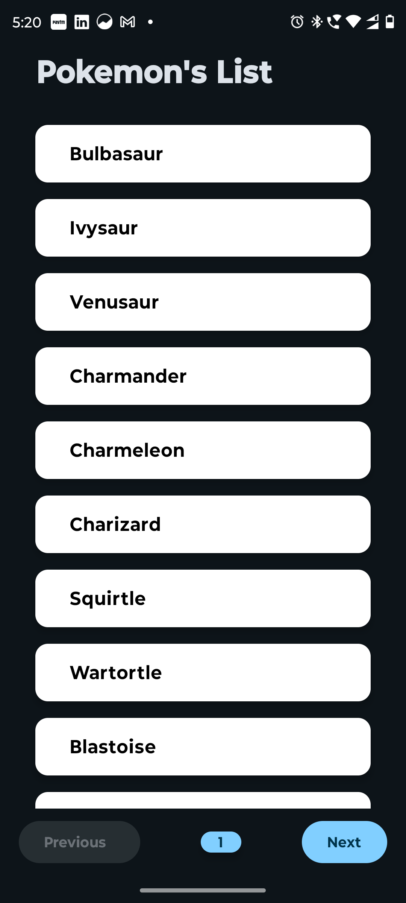
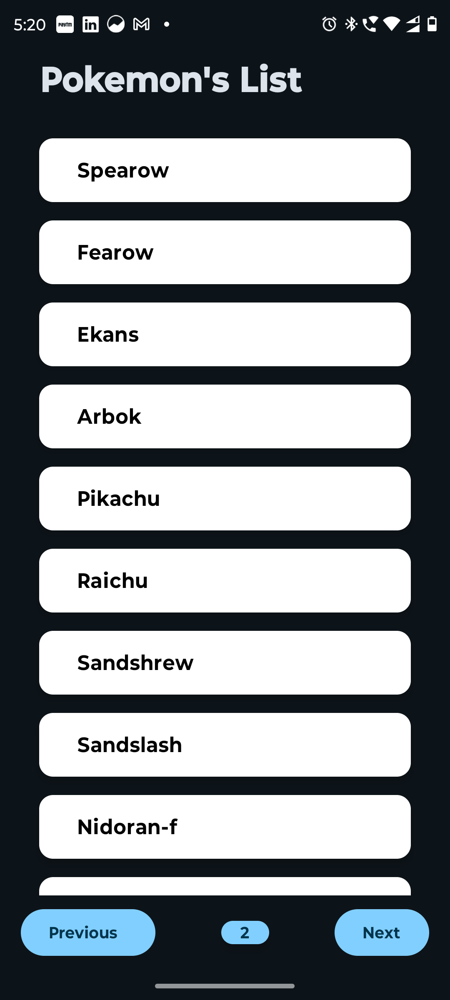
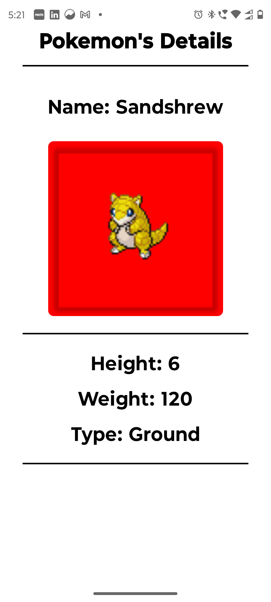

# Pokémon Application

## Overview

This Pokémon Application is built using Kotlin and Jetpack Compose. It utilizes the [PokéAPI](https://pokeapi.co/) to fetch data about various Pokémon and displays it in a user-friendly interface. The app features two main screens: the Pokémon List Screen and the Pokémon Detail Screen.

## Table of Contents

- Project Structure
- Pokémon List Screen
- Pokémon Detail Screen
- Changing the App Icon
- Dependencies
- Screenshots
- Videos
- APK Link

## Project Structure

The application follows the MVVM (Model-View-ViewModel) pattern. Here's how each component fits into this architecture:

### Model

- **Directory:** `model/`
- **Purpose:** Contains data classes like `Pokemon`, `PokemonDetail`, `PokemonListResponse`, etc. These classes represent the data structures used throughout the app and often correspond to the API responses.

### View

- **Directory:** `ui/`
- **Purpose:** Contains Composables such as `PokemonDetailScreen.kt` and `PokemonListScreen.kt`. These files define the UI components and layout of the application.

### ViewModel

- **Directory:** `viewmodel/`
- **Purpose:** Contains classes like `PokemonDetailViewModel.kt` and `PokemonListViewModel.kt`. These classes manage the data for the UI, handle business logic, and expose data via `StateFlow` or other observable mechanisms.

### Repository

- **Directory:** `repository/`
- **Purpose:** Contains `PokemonRepository.kt`. This class abstracts the data source, providing a clean API for data access to the rest of the application. It handles data operations and interacts with the network layer to fetch data.

### Network

- **Directory:** `network/`
- **Purpose:** Contains network-related classes like `ApiClient.kt` and `PokeApiService.kt`. These classes are responsible for making network requests and interacting with the API.

### Navigation

- **Directory:** `navigation/`
- **Purpose:** Contains `NavGraph.kt`, which defines the navigation graph and manages the navigation flow between different screens in the app.

## Screenshots

  
  
  
  

  
  
  

## Videos

### Dark Mode
[Watch Video](https://drive.google.com/file/d/1fKe1Wts6gTUIHUVkci1daIg0qnkJJrAu/view?usp=sharing)

### Light Mode
[Watch Video](https://drive.google.com/file/d/1n_WuvdkmHVR5yCA4v8RHL4CHk1qwNAXh/view?usp=sharing)

## APK Link
[Download APK](https://drive.google.com/drive/folders/1dTyfUA4COFN-jvoc3vT3B4qGguwAYm91?usp=sharing)
